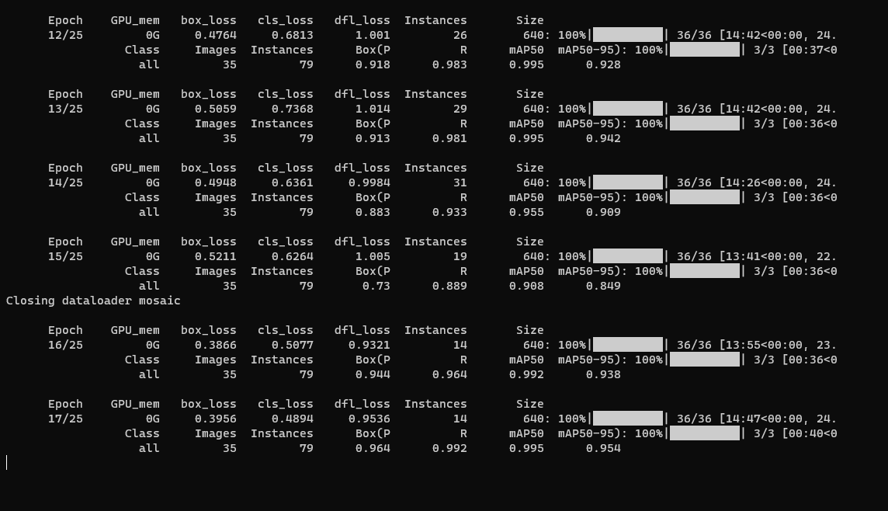

<body>

<h1>YOLOv8 Fruits Detection</h1>

    <h1>Abstract</h1>

    
This is a project on fruit detection in images using the deep learning model YOLOv8. The types of fruits used in
        this project include:

    <ul>
        <li>Avocado (Vietnamese: Bo)</li>
        <li>Tomato (Vietnamese: Ca chua)</li>
        <li>Orange (Vietnamese: Cam)</li>
        <li>Guava (Vietnamese: Oi)</li>
        <li>Bell Pepper (Vietnamese: Ot chuong)</li>
        <li>Red Apple (Vietnamese: Tao do)</li>
        <li>Green Apple (Vietnamese: Tao xanh)</li>
        <li>Dragon Fruit (Vietnamese: Thanh long)</li>
    </ul>

<table id="table-content" style="width: 200px">
    <caption><h2>Table of content</h2></caption>
    <tr>
        <td><a href="#content-install">1. Install</a></td>
    </tr>
    <tr>
        <td><a href="#content-train">2. Train</a></td>
    </tr>
    <tr>
        <td><a href="#content-predict">3. Predict</a></td>
    </tr>
</table>

<ol id="table-content-specific" style="list-style-type:upper-roman;">
    <li>
        <!--Content 1: Install-->
        

            <h2>Install</h2>
            <ol>
                <li>
                    <h3>Virtual environtment</h3>
                    <ol>
                        <li><h4>Please set up a virtual environment using either the <a
                                href="https://www.anaconda.com/download">Anaconda</a> or venv package of
                            <a href="https://www.python.org/downloads/">Python</a>.</h4>
                            
In this project, I created a virtual environtment named 「venv」

                            <ul>
                                <li>
                                    
venv package

                                    <code>python3 -m venv venv</code>
                                </li>
                                <li>
                                    
anaconda

                                    <code>conda create --name venv python=3.11</code>
                                </li>
                            </ul>
                        </li>
                        <li><h4>Then activate the environtment.</h4>
                            <ul>
                                <li>
                                    
venv package

                                    <code>.\venv\Scripts\activate</code>
                                </li>
                                <li>
                                    
anaconda

                                    <code>conda activate venv</code>
                                </li>
                            </ul>
                        </li>
                        <li><h4>Change directory to this project.</h4>
                            <code>cd path\to\this\project</code>
                        </li>
                    </ol>
                </li>
                <li>
                    <h3>YOLOv8 model</h3>
                    
<code>pip install ultralytics</code>

                </li>
            </ol>
        

        <!--End Content 1: Install-->
    </li>
    <li>
        <!--Content 2: Install-->
        

            <h2>Train</h2>
            <ul>
                <li><h3>CLI</h3>
                    <code>
                        yolo task=detect mode=train model=yolov8l.pt data=data.yaml device=0 epochs=100 patience=50 name=yolov8_fruits_detection workers=8 batch=8
                    </code>
                    <table style="width: 100%; border: 1px solid; border-collapse: collapse">
                        <caption><h4>where:</h4></caption>
                        <tr>
                            <th style="border: 1px solid; border-collapse: collapse; text-align: center">Argument</th>
                            <th style="border: 1px solid; border-collapse: collapse; text-align: center">Description</th>
                            <th style="border: 1px solid; border-collapse: collapse; text-align: center">Default</th>
                            <th style="border: 1px solid; border-collapse: collapse; text-align: center">Example</th>
                        </tr>
                        <tr>
                            <td style="border: 1px solid; border-collapse: collapse; text-align: center">model</td>
                            <td style="border: 1px solid; border-collapse: collapse; text-align: center">The model that you want to use</td>
                            <td style="border: 1px solid; border-collapse: collapse; text-align: center">-</td>
                            <td style="border: 1px solid; border-collapse: collapse; text-align: center">model=yolov8l.pt</td>
                        </tr>
                        <tr>
                            <td style="border: 1px solid; border-collapse: collapse; text-align: center">data</td>
                            <td style="border: 1px solid; border-collapse: collapse; text-align: center">Data file</td>
                            <td style="border: 1px solid; border-collapse: collapse; text-align: center">-</td>
                            <td style="border: 1px solid; border-collapse: collapse; text-align: center">data=data.yaml</td>
                        </tr>
                        <tr>
                            <td style="border: 1px solid; border-collapse: collapse; text-align: center">workers</td>
                            <td style="border: 1px solid; border-collapse: collapse; text-align: center">The number of processes that generate batches in parralel</td>
                            <td style="border: 1px solid; border-collapse: collapse; text-align: center">8</td>
                            <td style="border: 1px solid; border-collapse: collapse; text-align: center">workers=4</td>
                        </tr>
                        <tr>
                            <td style="border: 1px solid; border-collapse: collapse; text-align: center">device</td>
                            <td style="border: 1px solid; border-collapse: collapse; text-align: center">Device to run training</td>
                            <td style="border: 1px solid; border-collapse: collapse; text-align: center">-</td>
                            <td style="border: 1px solid; border-collapse: collapse; text-align: center">device=0[,1,2,3] if you have many GPUs, else device=cpu</td>
                        </tr>
                        <tr>
                            <td style="border: 1px solid; border-collapse: collapse; text-align: center">batch</td>
                            <td style="border: 1px solid; border-collapse: collapse; text-align: center">The number of images processed before updating the model</td>
                            <td style="border: 1px solid; border-collapse: collapse; text-align: center">16</td>
                            <td style="border: 1px solid; border-collapse: collapse; text-align: center">batch=8</td>
                        </tr>
                        <tr>
                            <td style="border: 1px solid; border-collapse: collapse; text-align: center">epochs</td>
                            <td style="border: 1px solid; border-collapse: collapse; text-align: center">The number of times the learning algorithm will work to process the entire dataset</td>
                            <td style="border: 1px solid; border-collapse: collapse; text-align: center">100</td>
                            <td style="border: 1px solid; border-collapse: collapse; text-align: center">epochs=100</td>
                        </tr>
                        <tr>
                            <td style="border: 1px solid; border-collapse: collapse; text-align: center">patience</td>
                            <td style="border: 1px solid; border-collapse: collapse; text-align: center">Epochs to wait for no observable to improvement for early stopping of training</td>
                            <td style="border: 1px solid; border-collapse: collapse; text-align: center">50</td>
                            <td style="border: 1px solid; border-collapse: collapse; text-align: center">patience=50</td>
                        </tr>
                        <tr>
                            <td style="border: 1px solid; border-collapse: collapse; text-align: center">name</td>
                            <td style="border: 1px solid; border-collapse: collapse; text-align: center">Folder name</td>
                            <td style="border: 1px solid; border-collapse: collapse; text-align: center">-</td>
                            <td style="border: 1px solid; border-collapse: collapse; text-align: center">name=fruits</td>
                        </tr>
                    </table>
                </li>

                <li><h3>Python</h3>
                    <code>python train.py</code>
                </li>
            </ul>
            
        

        <!--End Content 2: Install-->
    </li>
    <li>
        <!--Content 3: Predict-->
        

            <h2>Predict</h2>
            <ul>
                <li><h3>CLI</h3>
                    <code>
                        yolo task=detect mode=predict model=runs\detect\fruits\weights\best.pt source="test\images\1_tomato_31.jpg" save=True show=True
                    </code>
                    
                </li>
            </ul>
        

        <!--End Content 3: Predict-->
    </li>
</ol>

</body>
